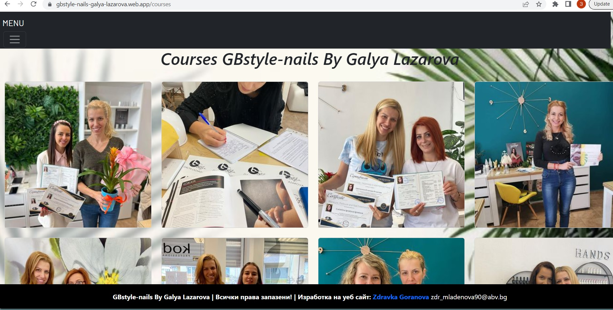

# GBstyle-nails By Galya Lazarova

"GBstyle-nails By Galya Lazarova" is abeauty salon website.The site offers various beauty treatments described in the category .

The  "GBstyle-nails By Galya Lazarova"  application contains the following views: home page, category page, about us page  callery page and beauty salon page.

The front end of the project has been deploy in Firebase:   https://gbstyle-nails-galya-lazarova.web.app

## Short description
 - This project was bootstrapped with [Create React App](https://github.com/facebook/create-react-app).
 - Single Page App (SPA) - React.js.Single Page App (SPA) - React.js.
 
 ## Usage
- `my-app` cd client  `npm start`

## Languages and libraries used
 - React.js
 - Javascript
 - HTML/CSS
 - Bootstrap
 
 ## Architecture - the project is structured
 - `my-app` folder contains the whole project.
 - `public` folder contains global asssets for the app(including the json file for simulating Web API calls).
 - `src` folder contains the App.js, index.js and folders for the components, contexts, reducers, contexts hooks and service.
 - `components` folder - properly named folder for each component that includes the component itself, the css  for the component).

 
# Routes views

## Home Page

## Salon Page

## Gallery Page

## Course  Page 

## Category Page

## AboutUs Page

